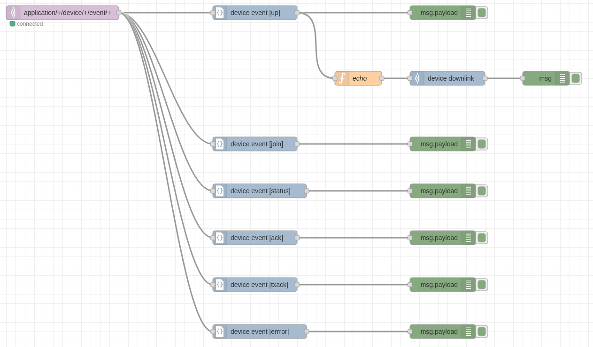

# ChirpStack Node-RED nodes

This package contains [ChirpStack](https://www.chirpstack.io/) nodes for
using with [Node-RED](https://nodered.org/).



## Installation

Please read the [Adding nodes to the palette](https://nodered.org/docs/user-guide/runtime/adding-nodes)
documentation for information on installing third-party nodes to Node-RED.

Example command:

```bash
npm install @chirpstack/node-red-contrib-chirpstack
```

## Usage example

This usage example creates an echo flow, which returns the received uplink back
to the device.

### MQTT in node (Node-RED)

After the `@chirpstack/node-red-contrib-chirpstack` package has been installed,
the first thing you must do is create a MQTT subscription using the *mqtt in*
node.

* Add the *mqtt in* node to your flow.
* Under properties select *Add new mqtt-broker...* and click the pencil icon.
* Enter the hostname of the server, when using TLS the port-number is usually `8883`, else `1883`.
* When using TLS make sure the *Use TLS* option is checked, select *Add new tls-config...* and click the pencil button.
	* If the MQTT broker is configured with client-certificate authentication and authorization,
      retrieve the certificate using the *Generate certificate* within the ChirpStack Application
      Server web-interface. Then upload the retrieved CA certificate, client-certificate and private
      key. Uncheck *verify server certificate* as the server-certificate will already be validated
      using the provided CA certificate. The click *Add*.
* Click once more *Add*, this takes you back to the initial form.
* As *Topic* enter `application/+/device/+/event/+` (in case you have modifications to the default
  ChirpStack configuration, modify this topic if needed).
* Click *Done*.

After deploying the flow containing the *mqtt in* node, you should see a green
bullet under the node with the status *connected*. If that is not the case,
validate the hostname, port and TLS configuration (if appliable).

### Device event node (ChirpStack)

After setting up the *mqtt in* node, add one or multiple *device event* nodes.
For each node you can select the *Event Type*. For this usage example select
*Uplink*. Connect this node with the *mqtt in* node.

### Debug node (Node-RED)

Add a *debug* node and connect it with the *device event [up]* node to log the
`msg.payload` for debugging.

### Echo function node (Node-RED)

Add a *function* node, and add the following code to the *On Message* event:

```js
return {
    "payload": msg.payload.data,
    "fPort": msg.payload.fCnt,
    "confirmed": false,
    "devEUI": msg.payload.devEUI
};
```

Connect this node with the *device event [up]* node.

### Downlink node (ChirpStack)

Add a *device downlink* node and enter:

* The hostname:port of the server (e.g. `localhost:8080` or `example.com:443`).
  this is the same hostname and port which is used to access the ChirpStack
  Application Server, but **without** the `http://` or `https://`.
* Select *Use TLS* when the endpoint is secured with a TLS certificate.
* Generate an API Key in the ChirpStack Application Server and paste the
  token under *API Token*.
* For this example set the *Payload Encoding* to *Base64*, as the uplink payload
  is encoded within the JSON payload as Base64.

Connect this node with the echo function node.

### Debug node (Node-RED)

Add an other *debug* node and connect it with the downlink node. This will
print the downlink frame-counter as debugging information. Make sure the
*Output* is set to *complete msg object*.
